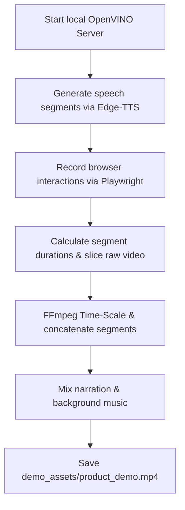

# Playbook: Automated Product Demo Video Pipeline

This guide outlines the architecture, setup, execution, and troubleshooting steps to maintain and recreate the automated product demo video pipeline for **Lumen Clinical**. It serves as a standard operating procedure (SOP) for future updates or adjustments.

---

## 🎯 Pipeline Objectives & Constraints

* **Duration Limit**: Under 3 minutes (currently targeting ~180 seconds to satisfy Lablab.ai and DoraHacks rules).
* **Sync Integrity**: Zero visual freeze frames during local AI inference or slow server responses. The video speed-scales dynamically to align with spoken narration.
* **Separated Subtitles**: SRT subtitles must be output as a separate sidecar file (`demo_assets/subtitles.srt`) rather than burned into the MP4.
* **Aesthetics**: Light Mode theme, high-end micro-interactions (zoom-in on panels, cursor visual trails, and custom background music mixed at `0.07` with a clean fade-out).

---

## 🛠️ System Dependencies & Environment Setup

The pipeline requires specific system-level tools and a Python virtual environment:

### 1. System Requirements
* **FFmpeg**: For slicing, video time-scaling, audio concatenation, and final background music mixing.
* **Node.js & Vite**: Hosting the local React development frontend.

### 2. Python Environment Setup
Create a virtual environment and install the required packages:
```bash
python3 -m venv .venv
source .venv/bin/activate
pip install playwright edge-tts fastapi uvicorn pydantic
playwright install chromium
```

---

## 🧱 Pipeline Architecture & Steps

The pipeline is managed by [scratch/build_demo_video.py](file:///home/sucharithpop/Downloads/new%20hackathon project/scratch/build_demo_video.py). It operates in 5 consecutive phases:



### Phase 1: Generate Speech Audio
Uses `edge-tts` to convert the narration text segments into `.mp3` files under `recordings/`. Dr. Reddy's intro voiceover (`name.m4a`) is dynamically concatenated between the `intro_1` and `intro_2` segments using FFmpeg.

### Phase 2: Playwright Web Walkthrough & Recording
A headless Chromium browser runs a Playwright script:
1. **Passcode Entry**: Inputs `LUMEN2026` to unlock the workstation.
2. **Settings Preset**: Selects the **Intel OpenVINO** local hardware acceleration model preset and applies it.
3. **Walkthrough Segments**: Steps through the Sandbox Simulation, Multimodal Board, Red-Team Lab, Clinical Compare, Clinical Copilot, Doc Workbench, Deep Research, Benchmark Lab, Safety Leaderboard, and FHIR Validation.
4. **Mouse & Zoom Helpers**:
   * Injects a red dot visual cursor helper (`#playwright-cursor`) to trace mouse movements.
   * `zoom_to_element(page, selector, scale)`: Zooms the entire page body onto specific focus areas (e.g. Chat panel, Multimodal Board, FHIR R4 Validation) using CSS transforms.
   * `zoom_out(page)`: Returns to 100% viewport scale.

### Phase 3: Slicing & Speed-Scaling
Since web UI responsiveness and model execution times vary, raw recording speed varies. To keep the video perfectly synchronized with the voice narration:
* **Video too slow**: Speed up using FFmpeg `setpts` filters:
  ```bash
  ffmpeg -i raw.webm -ss [start] -t [dur] -filter_complex "[0:v]setpts=(D_audio/D_video)*PTS,fps=25[outv]" -map "[outv]" -an scaled.mp4
  ```
* **Video too fast**: Pad the last frame (cloned freeze frame) using FFmpeg `tpad` filters:
  ```bash
  ffmpeg -i raw.webm -ss [start] -t [dur] -filter_complex "[0:v]tpad=stop_duration=[diff]:stop_mode=clone,fps=25[outv]" -map "[outv]" -an scaled.mp4
  ```

### Phase 4: Lossless Video Concatenation
Concatenates all 8 scaled video segments into `full_video_scaled.mp4`.

### Phase 5: Audio Amix & Fade
Combines the narration track (`full_audio.mp3`) with the background music (`bg_music.mp3`) at volume `0.07`, applying a 3-second audio fade-out.

---

## 🚨 Critical Reliability & Playwright Best Practices

When maintaining or updating the video scripts, adhere to the following rules:

### 1. Local Bypasses & Sandbox Mode
To prevent slow model server inferences or missing API credentials from crashing the walkthrough:
* **localStorage Flag**: The Playwright script sets `localStorage.setItem('lumen_use_demo_scripts', 'true')` after page navigation.
* **Handoff Bypasses**: Bypasses exist inside `runSafetyAudit` in [agentCore.ts](file:///home/sucharithpop/Downloads/new%20hackathon%20project/src/utils/agentCore.ts#L1240-L1270) and all client handlers in [bandClient.ts](file:///home/sucharithpop/Downloads/new%20hackathon%20project/src/utils/bandClient.ts#L20-L115) to prevent requests to `api.band.ai` or online Gemini endpoints, executing everything instantly locally.

### 2. Multi-Lab Unblocking Loop
Before executing a safety compilation step, loop to clear all pending tool runs (e.g. CPT imaging, LOINC blood count) so that compile buttons are active:
```python
# Execute all pending tool calls before compiling
while True:
    execute_btn = page.locator('button:has-text("Execute Lab")')
    if await execute_btn.count() > 0:
        if await execute_btn.first.is_visible():
            print("Executing pending tool call...")
            await click_with_mouse(page, execute_btn.first)
            await page.wait_for_timeout(3000)
            continue
    break
```

### 3. Coordinate Sync & Robust Selectors
* **Smooth Scrolling**: Wait `800ms` after calling `scrollIntoView` to let smooth scroll transitions finish before reading coordinates. Skip scrolling entirely if the element is already in the viewport.
* **Target Elements by Src**: For visual board assets, target by file name query (e.g., `img[src*="ecg_stemi"]`) instead of exact alt-text strings to avoid string-parsing mismatches.

---

## 🚀 Execution Guide

To run the pipeline and build a new demo video:
1. Ensure Vite is running (`npm run dev`) and listening on `http://localhost:3000/`.
2. Run the pipeline script:
   ```bash
   /home/sucharithpop/Downloads/re/.venv/bin/python scratch/build_demo_video.py
   ```
3. Watch the terminal logs to verify each walkthrough segment transition.
4. Retrieve the output files from:
   * **Video**: `demo_assets/product_demo.mp4`
   * **Subtitles**: `demo_assets/subtitles.srt`
